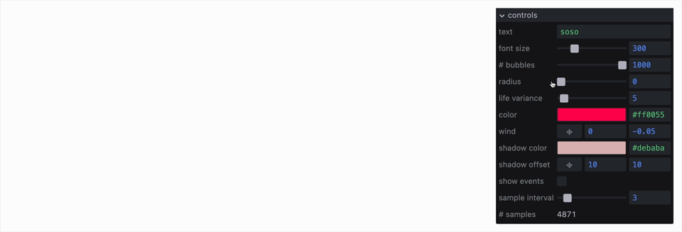

# knurl



A declarative, event-driven graphical interface for monitoring and modifying JavaScript variables.

[](https://www.npmjs.com/package/knurl)

[Examples](http://sophia-ooo.github.io/knurl/examples/) • [API](docs/api.md) • [Controls](docs/controls.md) • [Theming](docs/theming.md)

```js
import knurl from "knurl";

// Create a panel
const panel = knurl.create([
    { id: "speed", type: "range", min: 0, max: 10, value: 5 },
    { id: "color", type: "color", value: "#ff0055" },
    { id: "debug", type: "toggle", value: false },
]);

// Listen to changes
panel.subscribe((id, value) => {
    console.log(`${id} changed to:`, value);
});

// Update values
panel.set({ speed: 7 });

// Get current values
const { speed, color, debug } = panel.get();
```

## Installation

```bash
npm install knurl
```

## Why knurl?

- Define UI with JSON
- Changes emit events
- Minimal API

## Building

```bash
npm install        # Install dependencies
npm run build      # Build the library
npm run build:all  # Build library and examples
```

## License

MIT
